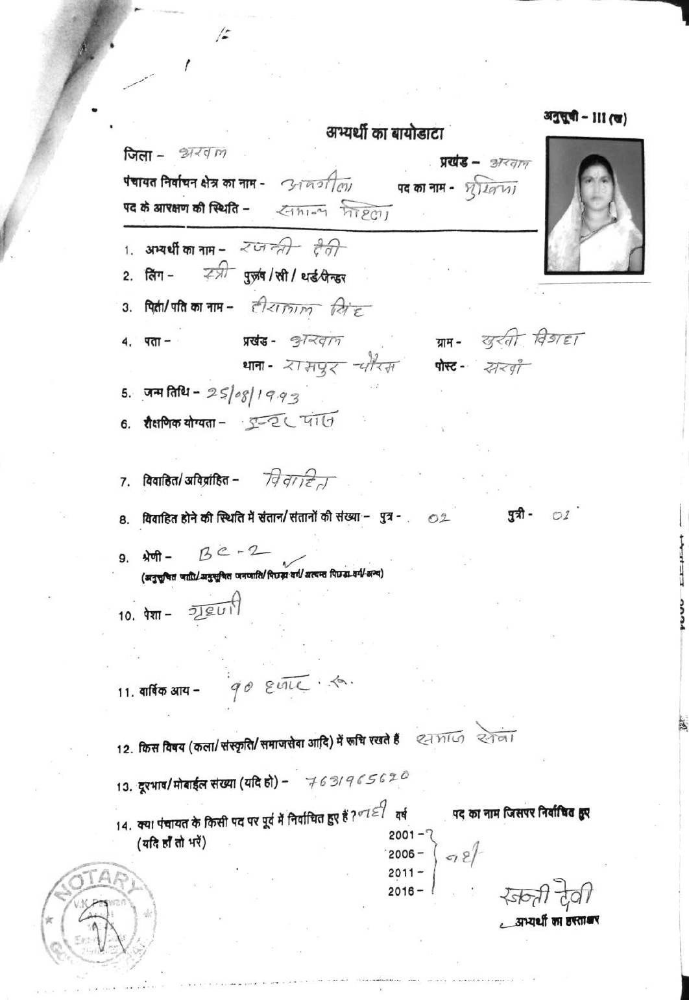

# Bihar Local Elections

[](https://github.com/in-rolls/local_elections_bihar/actions/workflows/ci.yml)
[](LICENSE)

Bihar panchayat election records from the State Election Commission (SEC) for 2016 and 2021. Source responses, typed exports, checksums and collection tools are included.

| Election | Offices | Contents | Section |
|---|---|---|---|
| 2016 | All six offices | 258,095 seats, 644,865 candidates and 210,717 winners, re-collected with every source page saved and validated against a declared schema | [2016 panchayat release](#2016-panchayat-release) |
| 2016 (original collection) | All six offices | 645,605 candidate records with attributes, seat reservation and valid votes | [2016 data](#2016-data) |
| 2021 | All six offices | 247,671 seats, 924,708 candidates, 968,562 result rows and 244,475 winners, validated against a declared schema | [2021 panchayat release](#2021-panchayat-release) |
| 2023 and 2025 by-elections | All six offices | 5,749 by-election seats, 8,449 candidates and 5,749 winners | [2021 panchayat release](#2021-panchayat-release) |
| 2021–2026 term | All six offices | Current winner and seat-reservation feeds, one row per seat; no election-year field | [2021 panchayat release](#2021-panchayat-release) |
| 2021, Arwal | Mukhiya winners | Self-reported education transcribed from nomination papers for 64 winners | [2021 and the current portal](#2021-and-the-current-portal) |

## 2021 panchayat release

[`data/release/2021_panchayat/`](data/release/2021_panchayat) holds the 2021 general election for every office: ward member, panch, mukhiya, sarpanch, panchayat samiti member and zila parishad member. It is built offline from saved SEC responses (candidate lists, results and the election rounds listed for each seat) by [`scripts/build_2021.py`](scripts/build_2021.py).

| Table | Grain | Rows |
|---|---|---:|
| [seats](data/release/2021_panchayat/seats.parquet) | One seat per office, with candidate, result and winner counts and an outcome status | 247,671 |
| [candidates](data/release/2021_panchayat/candidates.parquet) | Every contestant, with all candidate-list fields and the matched votes and win flag | 924,708 |
| [result_rows](data/release/2021_panchayat/result_rows.parquet) | Every result record; samiti and zila parishad seats report one row per candidate per panchayat | 968,562 |
| [winners](data/release/2021_panchayat/winners.parquet) | One winner per decided seat | 244,475 |
| [current_winners](data/release/2021_panchayat/current_winners.parquet) | The portal's undated 2021–2026 winner feed, one row per seat | 247,671 |
| [current_reservations](data/release/2021_panchayat/current_reservations.parquet) | The undated seat-reservation feed, one row per seat | 247,671 |
| [byelection_seats](data/release/2021_panchayat/byelection_seats.parquet) | One seat per by-election round (2023 phase 1, 2023 phase 2, 2025) | 5,749 |
| [byelection_candidates](data/release/2021_panchayat/byelection_candidates.parquet) | Every by-election contestant | 8,449 |
| [byelection_result_rows](data/release/2021_panchayat/byelection_result_rows.parquet) | Every by-election result record | 4,643 |
| [byelection_winners](data/release/2021_panchayat/byelection_winners.parquet) | One winner per by-election seat | 5,749 |

**Every column is declared.** [`scripts/schemas_2021.py`](scripts/schemas_2021.py) defines each table's types, nullability, allowed values, ranges, unique keys and link format with [pandera](https://pandera.readthedocs.io/). The build validates all tables before writing any; [`dictionary.csv`](data/release/2021_panchayat/dictionary.csv) and [`SCHEMA.json`](data/release/2021_panchayat/SCHEMA.json) are generated from the same models, and [`MANIFEST.json`](data/release/2021_panchayat/MANIFEST.json) records row counts, checksums, source-archive hashes and code hashes. Every source field becomes a column except `MobileNo`, which is excluded from the release; an unrecognised field stops the build.

**Coverage against independent counts.** Seats match the portal's published totals in every district and office. Candidates and winners compare with the SEC's [2021 election report](https://sec.bihar.gov.in/PanchayatRpt/ch13.aspx):

| Office | Seats | Candidates | Report candidates | Winners | Report elected | Sole candidates |
|---|---:|---:|---:|---:|---:|---:|
| Ward member | 109,641 | 505,438 | 505,463 | 109,510 | 109,554 | 1,270 |
| Panch | 109,641 | 216,429 | 217,051 | 106,656 | 107,431 | 31,420 |
| Mukhiya | 8,067 | 66,430 | 66,435 | 8,050 | 8,058 | 0 |
| Sarpanch | 8,067 | 49,698 | 49,709 | 8,044 | 8,059 | 0 |
| Samiti member | 11,095 | 73,778 | 73,798 | 11,065 | 11,092 | 0 |
| Zila parishad member | 1,160 | 12,935 | 12,937 | 1,150 | 1,159 | 0 |

A sole candidate is the only nominee for a seat with no result records; `winner_basis` marks these winners as inferred rather than flagged. [`audit.json`](data/release/2021_panchayat/audit.json) holds the full comparison, including block-level candidate counts (1,753 of 2,126 name-matched blocks equal), winner gender shares within 0.03 percentage points of the portal's statistics API, and a fresh re-download of 200 seats with no changes.

**Source problems the build handles explicitly:**

- The candidate list is renumbered in name order, so results are matched by name, not serial; `match_method` records how. 16,113 ward-member result rows have no serial at all. Numbered namesakes ("माया देवी 1", "माया देवी 2") are paired in list order, which held in 3,468 of 3,469 namesake groups where both serials exist; for all 29 winners matched this way, guardian and age agree with the current winner feed.
- 1,794 samiti, 215 zila parishad and 2 ward-member candidates appear only in results. They are kept with `in_candidate_list=false`; the report's candidate totals include them. 100 winners are among them, so their age, gender and nomination link are unknown here.
- In four samiti seats the win flag is set on only some of the winner's panchayat rows (`winner_flag_partial`). Each flagged winner has the highest summed vote, in these and every other seat.
- 362 current-feed rows are vacant-seat placeholders with no name, age 55 and a date in the photo field; they are flagged `vacant_placeholder` and their person fields are null.
- Nine zila parishad seats list the 2021 round but return no results. Reported ages include 93 outside 21–100 (maximum 1,987); they are kept and flagged `candidate_age_implausible`. One panch candidate has a blank name.
- By-elections come from the portal's by-election page, which lists 5,749 seats across the three rounds; the collected seats match its totals in every district, office and round, and every one is a seat of the 2021 frame. 4,499 by-election seats (3,498 of them panch) had a single nominee and no result records, so their winners are `sole_candidate` inferences; the other 1,250 have flagged winners, each with the highest summed vote.

Rebuild from the response archives and verify:

```sh
./crawl_offices.sh          # resumes collection, packs archives, builds and audits
make build-2021             # offline build from data/interim/2021/archive
make verify-2021-panchayat  # checksums, row counts, schemas and seat joins
make audit-2021             # independent comparisons (makes requests)
```

## 2016 panchayat release

[`data/release/2016_panchayat/`](data/release/2016_panchayat) holds the 2016 general election for every office, re-collected in September 2026 from the SEC's archived [results form](https://sec.bihar.gov.in/old-sec/ovc.aspx). [`scripts/sec_2016.py`](scripts/sec_2016.py) walks the form's office, district, block, panchayat and seat dropdowns and saves every response page; [`scripts/build_2016.py`](scripts/build_2016.py) builds the release offline from those pages.

| Table | Grain | Rows |
|---|---|---:|
| [seats](data/release/2016_panchayat/seats.parquet) | One row per seat in the form's dropdowns, with its reservation, page count and outcome | 258,095 |
| [candidates](data/release/2016_panchayat/candidates.parquet) | Every row of every seat's results table, with the saved page it came from | 644,865 |
| [winners](data/release/2016_panchayat/winners.parquet) | One winner per seat whose rows name one | 210,717 |

| Office | Seats | Record not found | Candidate rows | Winners | Uncontested winners |
|---|---:|---:|---:|---:|---:|
| Ward member | 114,583 | 16,473 | 277,148 | 97,515 | 11,547 |
| Panch | 114,583 | 21,248 | 136,021 | 85,692 | 50,237 |
| Mukhiya | 8,402 | 405 | 96,257 | 7,942 | 11 |
| Sarpanch | 8,402 | 486 | 45,054 | 7,881 | 27 |
| Samiti member | 11,142 | 303 | 80,259 | 10,793 | 17 |
| Zila parishad member | 983 | 88 | 10,126 | 894 | 3 |

**Every column is declared.** [`scripts/schemas_2016.py`](scripts/schemas_2016.py) defines each table's types, nullability, allowed values and unique keys with [pandera](https://pandera.readthedocs.io/); [`dictionary.csv`](data/release/2016_panchayat/dictionary.csv) and [`SCHEMA.json`](data/release/2016_panchayat/SCHEMA.json) are generated from the same models, and [`MANIFEST.json`](data/release/2016_panchayat/MANIFEST.json) records row counts, checksums and code hashes. Every cell of the results table becomes a column, kept verbatim alongside any typed version (`votes_raw` and `votes`, `age_raw` and `age`). Mobile number, address and email are included as the form published them. An unrecognised page label, table header, remark or gender stops the build.

**Checked against sources that share no code with it.** [`scripts/audit_2016.py`](scripts/audit_2016.py) writes [`audit.json`](data/release/2016_panchayat/audit.json):

- Seats equal the form's own frame for every office.
- 644,849 of the 644,958 distinct rows in the [original collection](#2016-data) are identical, cell for cell. The 109 others are 106 rows in Siwan's Ziradei block, where the original collectors filed one code's results under both panchayats that share it (below), and 3 names where they kept a space in place of a stray NUL. The release adds 4 candidates for one ward seat (Purvi Champaran, Kalyanpur, ward 16) that the original collection lacks.
- 30 seats re-requested with separate code on the day of the build returned the saved rows unchanged.
- The SEC's 2016 reservation rosters list the same number of seats of each reservation type as the release for mukhiya, sarpanch and samiti seats in every district whose roster is readable (8,609 seats; 83 of the 228 roster PDFs are scans without text). For zila parishad seats, compared one by one, 11 of 409 differ.

**Winners are derived, not flagged.** The 2016 form has no winner marker. `winner_basis` is `uncontested` when Remarks says so, `lot` when a tie was decided by drawing lots (shown on the winner's row as `136+1`, `951+1=952` or `986+1 (BY LAUTARI)=987`; 3 seats), and otherwise `top_vote`. No winner is named for 402 seats, recorded in `winner_note`: 163 where two candidates share the top vote with no lot mark, 206 where a candidate is listed twice with different vote counts (a Sitamarhi mukhiya seat lists each of six candidates twice, one with 19 and 314) and it is not stated whether those are parts to add or an entry that replaced another, and 33 with two different uncontested candidates.

**Source problems, kept as recorded:**

- 39,003 seats answer "Record not Found". They are kept with `status=no_record`; the original collection has no rows for them either. They cluster: over half the panch seats in Nawada, Saran and Purvi Champaran, and over half the ward seats in Nawada and Saran, are among them.
- Siwan's Ziradei block codes two panchayats as 10, so the form returns one set of results for both and which panchayat it belongs to cannot be told; the 48 seat rows involved are flagged `code_repeated` and their candidates appear once.
- 4,823 of 266,589 candidates in seats reserved for women are recorded as male; 2,733 of them have names such as DEVI, KUMARI or KHATOON, so the gender field was mis-entered. In seats reserved for Scheduled Tribes, one candidate in six carries another category, mostly Scheduled Caste.
- The form's reservation label for 90 samiti and 10 zila parishad seats differs from the one in the original collection.
- Ages are kept as typed (`age_raw`), with values above 120 (ages run into phone numbers, such as `229525839157`) nulled in `age`; 796 candidates are recorded as under 21. Serial numbers are sometimes blank, zero or repeated (`sr_no_repeated`); `row` gives each row's position.

**The saved pages are deposited.** Every page the form returned, the seat frame,
the reservation rosters and the three release tables are archived at
[10.5281/zenodo.22852474](https://doi.org/10.5281/zenodo.22852474) under CC0:
2.79 GB, with a checksum for every file. The 2.5 GB page archive is deposited as
48 parts that concatenate back into it, because Zenodo will not accept an upload
that large in one piece. A candidate row's `page_sha256` is the digest of the
page in that archive, so the tables can be rebuilt from the deposit alone.

Rebuild from the saved pages and verify:

```sh
./crawl_2016.sh             # resumes collection, packs the pages, builds and audits
make build-2016             # offline build from data/interim/2016/archive
make verify-2016-panchayat  # checksums, row counts, schemas and seat joins
make audit-2016             # independent comparisons (makes requests)
```

## 2016 data

Candidate information and valid votes collected from the [historical SEC results form](http://sec.bihar.gov.in/ovc.aspx). The original six CSVs are preserved. The [2016 panchayat release](#2016-panchayat-release) re-collects the same form with every page saved and is compared with these files row by row.

| File | Source office | Records | Later exact copies | Missing candidate names |
|---|---|---:|---:|---:|
| [mukhiya.parquet](data/fin/mukhiya.parquet) | Mukhiya | 96,266 | 0 | 5 |
| [sarpanch.parquet](data/fin/sarpanch.parquet) | Sarpanch | 45,059 | 0 | 3 |
| [ward_member.parquet](data/fin/ward_member.parquet) | Ward Member | 277,219 | 2 | 9 |
| [panch.parquet](data/fin/panch.parquet) | Panch | 136,676 | 640 | 1 |
| [panchayat_samiti_member.parquet](data/fin/panchayat_samiti_member.parquet) | Panchayat Samiti Member | 80,259 | 0 | 3 |
| [zila_parishad_member.parquet](data/fin/zila_parishad_member.parquet) | Zila Parishad Member | 10,126 | 0 | 1 |

There are 645,605 collected rows across the six files. Each file contains labels for 38 districts. These are candidate-record counts, not unique seats, people, or independently verified election totals. Mukhiya and Sarpanch are separate source offices, as are Ward Member and Panch; the converter does not combine them.

Original files remain in [data/](data/). [MANIFEST.json](data/fin/MANIFEST.json) records input/output checksums, schemas, row counts, later duplicate counts, and missing-name counts. [schemas.json](schemas.json) declares the exact columns and office expected for each file.

## Column dictionary

The source columns remain strings, including age, vote cells, identifiers, and contact fields. Empty cells become null; leading zeroes and original-script text are preserved. Added year and provenance fields are typed explicitly.

| Column | Meaning |
|---|---|
| `year` | int16; 2016, assigned from the documented collection rather than a source CSV column |
| `post` | Source office label |
| `district`, `block`, `panchayat`, `ward` | Source geography; lower-level columns occur only in the applicable files |
| `number` | Source territorial/constituency identifier; it is scoped to its office and geography |
| `reservation_status` | Reservation status of the seat |
| `sr_no` | Candidate serial within the source table |
| `candidate_name`, `father_husband_name` | Candidate and relation-name fields |
| `gender`, `age`, `category`, `educ` | Candidate attributes as supplied by the source |
| `mobile_number`, `address`, `email` | Historical candidate contact fields |
| `valid_vote`, `remarks` | Source valid-vote cell and remarks |
| `source_row` | int32; logical source CSV row, starting at 1 after the header |
| `duplicate_of_source_row` | Nullable int32; first row with exactly the same source-cell values, for later copies |
| `candidate_missing` | bool; candidate name is empty or whitespace-only |

Seat `reservation_status` and candidate `category` are different variables. Neither is inferred from names. `valid_vote` is not recoded from text into a numeric outcome, and `remarks` is not assumed to encode a universally reliable winner flag.

The Mukhiya and Sarpanch files include district, block, and panchayat. Ward Member and Panch add ward. Panchayat Samiti Member includes district and block; Zila Parishad Member includes district. The manifests preserve these differences rather than fabricating unavailable lower-level identifiers.

## Coverage and known gaps

**All source rows are retained.** There are 642 later exact copies: 640 in Panch and two in Ward Member. Their `duplicate_of_source_row` values point to the first copy in that file. This records a reproducible relationship without deciding whether repeated source observations should be removed for a particular analysis. Duplicate tracking continues across output batches.

Twenty-two rows have no usable candidate name. They remain in the export with `candidate_missing=true`. Original whitespace is preserved where present, so the flag can be true even when the raw cell contains spaces.

The historical collectors traversed dropdowns for office, district, block, panchayat, and territorial unit, with different paths for each office. They supported manual resume positions and appended results to CSVs. A complete acquisition manifest and saved raw HTML were not retained. Row counts therefore cannot establish complete coverage or explain every duplicate and omission. Original request times and failed units cannot be reconstructed from the published CSVs alone.

The data do not supply a verified cross-office or cross-election person/seat identifier. Do not treat `number` or `sr_no` as globally unique. Historical contact fields and candidate attributes have not been checked for current accuracy. The six historical CSVs cover 2016 only; later collections have separate directories.

## How collected

| Stage | Method | Retained evidence |
|---|---|---|
| Enumeration | The SEC results form's office and geographic dropdowns | Source office/geography columns in each CSV |
| Candidate results | Separate ASP.NET form traversal for each of the six offices | Candidate attributes, seat reservation, votes, and remarks |
| Publication | Appended CSV rows from the historical collection | Six original CSV files |
| Parquet export | Offline conversion in batches of 5,000 rows | Typed schemas, source-row provenance, duplicate links, and checksums |

The [historical implementation](https://github.com/in-rolls/local_elections_bihar/tree/1efc650) preserves the six collection scripts. The offline converter makes no requests to the historical SEC form. Later collections use the current portal and separate scripts.

## 2021 and the current portal

| Collection | Coverage | Records | Files |
|---|---|---:|---|
| Current mukhiya winner index | All 38 districts and 533 blocks listed by the portal | 8,067 winners | [Winners](data/fin/portal_2021_2026/winners.parquet), [seat reservations](data/fin/portal_2021_2026/reservations.parquet), [manifest](data/fin/portal_2021_2026/MANIFEST.json) |
| Explicit 2021 mukhiya election | 38 districts, 533 blocks, 8,067 enumerated panchayats | 66,430 candidacies; 66,392 result records; 8,050 flagged winners | [Candidates](data/release/2021/gp_head_candidates_2021.parquet), [winners](data/release/2021/gp_head_winner_records_2021.parquet), [coverage](data/release/2021/coverage.parquet), [validation](data/release/2021/validation.json) |
| 2021 winner qualifications | All 64 Arwal winners inspected | Degree status classified for 57; unresolved for 7 | [CSV](data/fin/2021/education.csv), [Parquet](data/fin/2021/education.parquet), [transcriptions](data/fin/2021/education_review.csv), [sources and checksums](data/fin/2021/education.json) |

Sources: SEC [winning candidates](https://sec25.bihar.gov.in/sec_new/Panchayat/WinningCandidates), [seat reservations](https://sec25.bihar.gov.in/sec_new/Panchayat/Reservation), [contesting candidates](https://sec25.bihar.gov.in/sec_new/Panchayat/ContestingCandidates), and [results](https://sec25.bihar.gov.in/sec_new/Panchayat/Result). Responses were collected on September 10, 2026. The statewide collection completed 533 winner requests and 533 reservation requests; it covers the portal's listed blocks, not an independently verified historical census of seats.

**The statewide index has no election-year field.** Its `year` is null: the portal covers the 2021–2026 term and later by-elections. The separate statewide 2021 release requests phase `2021_1`, displayed as `2021`. All 66,392 results are matched to a candidate-list row; 38 candidacies have no result record. Of 8,067 enumerated panchayats, 8,050 have one flagged winner, eight have results without a winner flag, and nine return empty results. All remain in the [coverage table](data/release/2021/coverage.parquet). The frame was retrieved in 2026; it is not an independent census of seats as constituted in 2021.

**Reservation checks:** the [SEC’s 2021 report](https://sec.bihar.gov.in/PanchayatRpt/ch1.aspx) and the saved feed both contain 8,067 mukhiya seats, including 3,583 women-reserved seats. The current reservation and winner feeds agree on women’s reservation for all 8,067 seats. Caste totals differ from the report by one seat (SC +1, BC −1). All 8,050 dated winners join by district, block and panchayat IDs. Of 35 winners coded male in women-reserved seats, 31 are coded female in the current winner feed; both feeds link to the same nomination document for all 35. These gender conflicts do not establish reservation errors. Matching current feeds and totals does not verify every historical assignment. [Checks](data/fin/reservation_check_2021/validation.json), [flagged records](data/fin/reservation_check_2021/flagged_winners.parquet), [source hashes and schema](data/fin/reservation_check_2021/MANIFEST.json), and [offline audit](scripts/check_reservations_2021.py).

**Education has been transcribed for 64 Arwal winners.** All 64 winners were linked to candidate lists using district, block, panchayat and candidate serial, then their downloaded nomination PDFs were inspected. [The export](data/fin/2021/education.csv) retains the reported qualification, degree and literacy indicators, prior elected office, document reservation text, source URL, page number and PDF hash. [Inspected pages](data/fin/2021/education_pages) accompany the transcriptions.

Degree status is unresolved for seven winners: two documents lack the candidate's education page, one names a school without a qualification, one says only “EDUCATED,” and three have ambiguous qualification text. Unknowns remain null. Reservation is classified from document text for 51 winners; 13 remain unspecified. Of the 25 document-classified women's reserved seats, 21 have classified degree status; the corresponding counts are 24 of 26 open seats and 12 of 13 seats with unspecified reservation. These are extraction counts, not reservation-effect estimates. [Coverage and provenance](data/fin/2021/education.json).

Codex visually transcribed these records; there has been no independent second coding. Tesseract locates likely pages but does not assign qualifications. Candidate and proposer biographies are distinguished. Qualifications are self-reported, and a blank field is not evidence of illiteracy. These transcriptions cover Arwal. Statewide affidavit collection and extraction were stopped at the owner’s request. The public winner table and 2021 candidate-detail page checked for Awgila contain no structured education field; statewide 2021 education remains unavailable in this release.

<details>
<summary>Inspect a qualification declaration</summary>

Rajanti Devi's candidate biography reports “इंटर पास” (intermediate passed). The seat-reservation field reads “सामान्य महिला.” [Original PDF, page 12](https://sec2021.bihar.gov.in/ForPublicPDF_P/Documents1n2/NominationDoc/20210909141417391.pdf#page=12).



</details>

### Fields and handling

- `district_id`, `block_id`, `post_id` and `panchayat_id` locate records. Candidate serials are scoped to election, office and full geography. IDs from different elections are not assumed to identify the same seat.
- Winner exports retain `candidate_age`, `candidate_gender`, `candidate_category`, affidavit/photo URLs and source geography. `reservation_for_reported` and `reservation_status_reported` are fields from the winner feed; `seat_reservation` comes from the separate reservation feed. These fields are not interchangeable: the first Arwal block already contains a disagreement between the two feeds' caste-reservation labels.
- The 2021 file keeps candidate lists and results separately. Candidate lists carry age, gender and document links; results carry votes and `elected`. All geographic/serial keys are unique within each feed. **Results are matched to candidates by name within the panchayat, not by serial.** The candidate list is renumbered in name order while results keep their own serial, so in 39 panchayats the same serial names different people. An earlier serial join attached 168 results, including 15 winners, to the wrong candidate; those winners carried another candidate's age, and two another's gender. `match_method` records each match: 66,194 by serial and name, 169 by name at a different serial, and 29 where the result name adds a title such as “श्रीमति” or “बीबी”. `result_serial` keeps the result feed's own serial. No Arwal winner was affected, so the education links are unchanged.
- `source_url`, `fetched_at`, `source_sha256`, `source_row` and `raw_cell` trace each exported row to the saved response. Source cells remain unchanged in `raw_cell`; typed columns facilitate analysis. Schemas and hashes accompany the exports.
- [Raw responses](data/raw/portal_2021_2026) are gzipped request ledgers with HTTP status, UTC time and the original response bytes encoded as base64. The geographic frame retains district/block/office paths. A completed checkpoint is reused; missing or truncated checkpoints are fetched again. HTML error pages are rejected rather than counted as empty results.

Collection uses three HTTP sessions. A nine-request pilot took 3.8 seconds with three sessions; three sequential requests took 3.1 seconds. The statewide mukhiya job requires 1,066 data requests plus frame enumeration. District-only and all-office requests returned no records in reconnaissance, so collection follows the working office/block request pattern.

```sh
uv run python scripts/sec_portal.py list
caffeinate -dims uv run python scripts/sec_portal.py fetch --posts 3
uv run python scripts/sec_portal.py parse
./crawl.sh
```

Omit `caffeinate -dims` outside macOS. The generic collector accepts post IDs 1–6: ward member, panch, mukhiya, sarpanch, panchayat samiti member and zila parishad member. The published current-portal collection is mukhiya only. Use `--districts` to restrict collection and `--workers` to set concurrency. Parsing is offline and can be rerun against the saved responses.

### State release and central import

The [central repository](https://github.com/in-rolls/local_elections) contract assigns collection, parsing and corrections to this repository. `local_reservations` imports the versioned state release through its Bihar adapter; `quota_elite_quality` consumes the harmonized data for analysis. The central adapter pins the 2021 table hashes and checks row counts, schemas, unique keys and winner/coverage reconciliation. The six 2016 inputs retain their existing paths.

The 2021 release includes an explicit [schema](data/release/2021/SCHEMA.json), [dictionary](data/release/2021/dictionary.csv), [checksums](data/release/2021/CHECKSUMS), and [manifest](data/release/2021/MANIFEST.json) linking rows to saved SEC responses. Candidate and result observations retain separate source URLs, hashes and row locators. Missing results remain null. The undated current reservation feed is excluded from this release.

Restore the complete [raw-response archive](data/raw/statewide_2021.tar.gz), then rebuild offline:

```sh
mkdir -p data/raw/statewide_2021
tar -xzf data/raw/statewide_2021.tar.gz -C data/raw/statewide_2021
make release-data
make verify-2021
```

[Archive metadata](data/raw/statewide_2021_archive.json) records its checksum. `./crawl.sh` resumes collection and downloads every flagged winner's affidavit if explicitly restarted; acquisition is currently stopped. PDFs are checked for a PDF signature, readable page count and SHA-256; failures are retained and retried on resume. The download stops before consuming the final 5 GiB of disk space. Live progress is saved to `data/interim/2021/download_status.parquet`, with one row for every requested winner, and a matching JSON summary. PDF bytes remain local during acquisition; the response archive and released tables are published.

Rebuild the reservation source checks offline with `uv run python scripts/check_reservations_2021.py`.

### Rebuild qualifications

Install Poppler (`pdfinfo`, `pdftoppm`, `pdftotext`) and Tesseract with English and Hindi language data. On macOS, `brew install poppler tesseract tesseract-lang` supplies these tools; Ubuntu uses `poppler-utils tesseract-ocr tesseract-ocr-hin`.

```sh
uv run python scripts/affidavits.py frame
caffeinate -dims uv run python scripts/affidavits.py download
caffeinate -dims uv run python scripts/affidavits.py locate
uv run python scripts/affidavits.py export
```

Download and page-location stages resume from `data/derived/affidavits_2021/`. Export combines the checked-in review CSV with downloaded document metadata and page images. It rejects duplicate or missing review keys, invalid binary codes, mismatched source hashes, and pages outside the document. The review CSV is the visual-transcription input; OCR alone cannot regenerate it. `graduate_plus=1` means a reported completed degree, `0` a reported lower qualification, and null an unresolved level. `illiterate` and `prior_elected` likewise preserve unknowns. `quota_document` records women's seat reservation from the document, independently of candidate gender; it is not an official reservation-roll validation.

## Usage

```sh
git clone https://github.com/in-rolls/local_elections_bihar.git
cd local_elections_bihar
uv sync --frozen --group dev
make verify-data
```

Read a published file:

```python
import pyarrow.parquet as pq

table = pq.read_table("data/fin/mukhiya.parquet")
print(table.num_rows)
print(table.schema)

candidates = pq.read_table("data/release/2021/gp_head_candidates_2021.parquet")
winners = pq.read_table("data/release/2021/gp_head_winner_records_2021.parquet")
print(candidates.num_rows, winners.num_rows)
```

Rebuild the six exports:

```sh
make to-parquet
make verify-data
```

Conversion checks the office label and exact column list, keeps row order, and writes through a temporary file before replacing an export. Verification compares the stored schema and every batch with the original CSV-derived records, then checks the source and output hashes.

## Development

```sh
make check
make ci-docker
```

Checks cover all six schemas, separate candidate/seat categories, leading zeroes, repeated records across batch boundaries, missing names, extra output rows, and interruptions after partial writes. Ruff, formatting, pre-commit, and complete export verification run locally. CI and the standard Docker target test Python 3.12 and 3.14.

## Citation

Gaurav Sood. *Bihar Local Elections*. Include the repository URL and commit used. [CITATION.cff](CITATION.cff) provides machine-readable metadata. Contact: [contact@gsood.com](mailto:contact@gsood.com).

## License

Code is [MIT licensed](LICENSE). The election results were published by the Bihar State Election Commission. No separate data license is asserted in this repository.

## 🔗 Adjacent Repositories

- [in-rolls/local_elections_kerala](https://github.com/in-rolls/local_elections_kerala) — Kerala Local Government Seat Reservation Data and Winner Attributes
- [in-rolls/local_elections_up](https://github.com/in-rolls/local_elections_up) — UP Local Election Data --- GP and ULB. Seat reservation, winner, and candidates for some elections
- [in-rolls/local_elections_uttarakhand](https://github.com/in-rolls/local_elections_uttarakhand) — Data on Local Elections from Uttarakhand
- [in-rolls/ration_bihar](https://github.com/in-rolls/ration_bihar) — Scripts for scraping Ration Card Data From Bihar
- [in-rolls/parse_unsearchable_rolls](https://github.com/in-rolls/parse_unsearchable_rolls) — Parse Unsearchable Electoral Rolls
