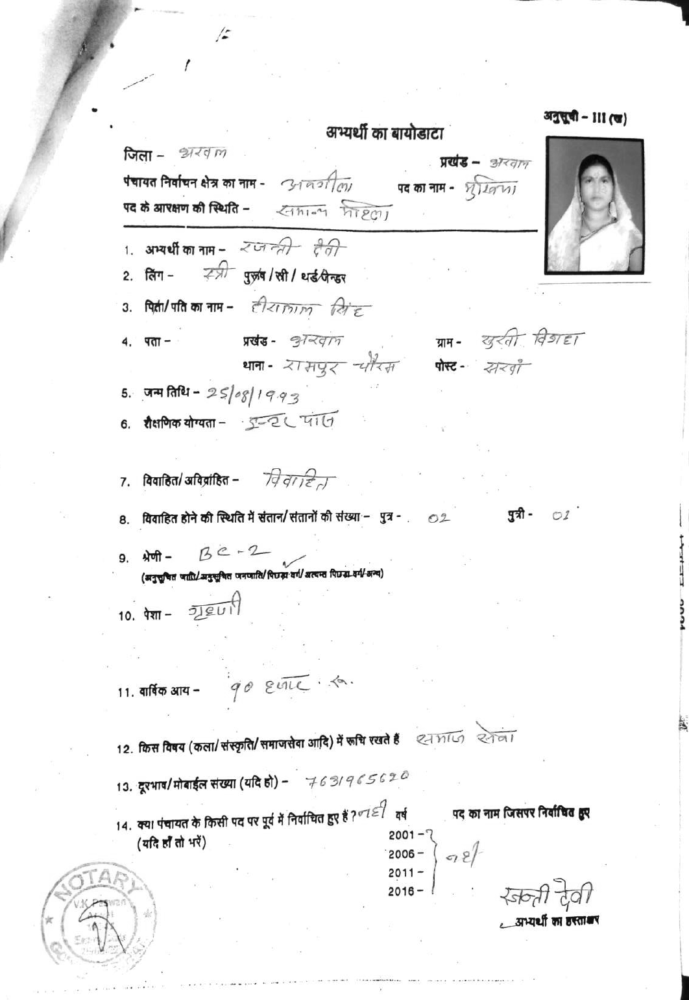

# Bihar Local Elections

[](https://github.com/in-rolls/local_elections_bihar/actions/workflows/ci.yml)
[](LICENSE)

This repository records **which Bihar panchayat seats were reserved, who contested
those seats, and who won**. The aim is to cover all recoverable general elections
and by-elections, with candidate attributes and an evidence-backed history of
seats across elections. Sources come from the State Election Commission (SEC)
and preserved historical collections.

## Scope and collection priorities

The six offices are **ward member, panch, mukhiya, sarpanch, panchayat samiti
member and zila parishad member**. All candidates are in scope, including losing
and uncontested candidates. Municipal elections, indirectly elected leadership
posts, affidavits, turnout and polling logistics are deferred.

Collect sources that add one or more of the following:

- **Seats and reservations:** office, election, district/block/panchayat, seat
  identifiers and labels, reservation category and women's reservation.
- **Candidates and outcomes:** names, votes, winner status and its basis, and
  reported gender, category, age, education, occupation and other available
  attributes from ordinary election records.
- **Seat history and evidence:** source dates, geography and boundary records
  needed to establish election vintage, link seats across years or resolve
  conflicting reservation and result records.

Keep seat reservation distinct from candidate category and gender. Preserve
source labels alongside standardized values, and record unknowns and conflicts.
Never infer a candidate's category or gender from their name or the reservation
of the seat. Distinguish official winner declarations from winners inferred from
votes or uncontested status.

General elections and each by-election round are separate events. Later
occupation of a seat must not overwrite its election winner. An undated term
snapshot is not an election-specific reservation roster. Cross-year seat links
require geographic evidence: matching codes or names alone do not establish
continuity. Record renaming, boundary changes, splits, mergers and unresolved
matches explicitly.

A source need not supply every field to be useful. Retain candidate records with
missing reservation links, known seats with missing results and winner-only
sources with explicit limits on candidate coverage. Preserve one canonical copy
of each necessary original, final tables and compact receipts; disposable
intermediates are not archival assets. See the [data guide](data/README.md) for
storage and reproducibility.

### What exists and what remains

The [coverage report](data/coverage.csv), with [definitions and source hashes](data/coverage.json),
is generated from the parsed tables by `make coverage`. It reports frame seats,
ambiguous seat codes, seats with candidates and winners, reservation-label
coverage, candidate records with votes and winner determination by election and
office. Empty numeric cells mean unavailable, not zero.

2016 has reservation labels in election result pages. The 2021-term reservation
feed is reported separately as a snapshot; linking its labels to specific
elections remains an evidence task. General-election seat links between years
have not been established. By-election seats already have membership in the
2021 term frame; that does not establish continuity with the 2016 frame.

The current priorities are to resolve historical source dates, parse useful
reservation/candidate/winner records, close gaps in election-specific reservation
linkage and outcomes, and establish supported seat links across years. For 2011,
use the confirmed 2011 report collection while checking the Gaya workbook/PDF
name differences against the originals before combining their records. The SEC
turnout table and the indirect-leadership rosters are not collection priorities.

## Available data

| Folder | Election | Contents |
|---|---|---|
| [`data/2016/`](data/2016) | 2016 general election, all six offices | 258,095 seats, 644,865 candidates, 210,717 winners |
| [`data/2021/`](data/2021) | 2021 general election, all six offices | 247,671 seats, 924,708 candidates, 968,562 result rows, 244,475 winners |
| | 2023 and 2025 by-elections | 5,749 seats, 8,449 candidates, 5,749 winners |
| | 2021–2026 term | Current winner and seat-reservation feeds, one row per seat |
| [`data/2021/reservation_check/`](data/2021/reservation_check) | 2021 mukhiya seats | Reservation totals checked against the SEC report; 35 source conflicts flagged |
| [`data/2011/gaya_mukhiya/`](data/2011/gaya_mukhiya) | 2011 workbook and PDF collection | 331 workbook winner records; 338 PDF winner records and 338 runner names, kept separate |
| [`data/2011/mukhiya_reports/`](data/2011/mukhiya_reports) | 2011, maintainer-confirmed PDF collection | 4,320 winner records across 23 districts, with 4,318 reservation labels; includes the 338 Gaya PDF records |
| [`data/2011/khajuria_judgment/`](data/2011/khajuria_judgment) | Explicitly dated 2011 contest | 11 candidates and votes for Khajuria, Bhojpur, manually transcribed from a court judgment |
| [`data/README.md`](data/README.md) | All years | Local source layout, size catalog, receipts, and restore instructions |

The [Gaya Mukhiya pilot](data/2011/gaya_mukhiya/README.md) keeps workbook and PDF records separate pending review of extracted name differences. The PDF collection is assigned to 2011 using maintainer confirmation and its prior-election headings; the [year receipt](data/provenance/2011_report_year.json) records that evidence. See [Earlier elections](#earlier-elections).

## 2016

[`data/2016/`](data/2016) holds the 2016 general election for every office, re-collected in September 2026 from the SEC's archived [results form](https://sec.bihar.gov.in/old-sec/ovc.aspx). [`scripts/sec_2016.py`](scripts/sec_2016.py) walks the form's office, district, block, panchayat and seat dropdowns and saves every response page; [`scripts/build_2016.py`](scripts/build_2016.py) builds the tables offline from those pages.

| Table | Grain | Rows |
|---|---|---:|
| [seats](data/2016/seats.parquet) | One row per seat in the form's dropdowns, with its reservation, page count and outcome | 258,095 |
| [candidates](data/2016/candidates.parquet) | Every row of every seat's results table, with the saved page it came from | 644,865 |
| [winners](data/2016/winners.parquet) | One winner per seat whose rows name one | 210,717 |

| Office | Seats | Record not found | Candidate rows | Winners | Uncontested winners |
|---|---:|---:|---:|---:|---:|
| Ward member | 114,583 | 16,473 | 277,148 | 97,515 | 11,547 |
| Panch | 114,583 | 21,248 | 136,021 | 85,692 | 50,237 |
| Mukhiya | 8,402 | 405 | 96,257 | 7,942 | 11 |
| Sarpanch | 8,402 | 486 | 45,054 | 7,881 | 27 |
| Samiti member | 11,142 | 303 | 80,259 | 10,793 | 17 |
| Zila parishad member | 983 | 88 | 10,126 | 894 | 3 |

**Every column is declared.** [`scripts/schemas_2016.py`](scripts/schemas_2016.py) defines each table's types, nullability, allowed values and unique keys with [pandera](https://pandera.readthedocs.io/); [`dictionary.csv`](data/2016/dictionary.csv) and [`SCHEMA.json`](data/2016/SCHEMA.json) are generated from the same models, and [`MANIFEST.json`](data/2016/MANIFEST.json) records row counts, checksums and code hashes. Every cell of the results table becomes a column, kept verbatim alongside any typed version (`votes_raw` and `votes`, `age_raw` and `age`). Candidate attributes (age, gender, category, education) and the mobile number, address and email are included as the form published them. An unrecognised page label, table header, remark or gender stops the build.

**Checked against sources that share no code with it.** [`scripts/audit_2016.py`](scripts/audit_2016.py) writes [`audit.json`](data/2016/audit.json):

- Seats equal the form's own frame for every office.
- An earlier collection of the same form, six CSVs from 2016 kept in `data/2016/raw/legacy`, agrees cell for cell on 644,849 of its 644,958 distinct rows. The 109 others are 106 rows in Siwan's Ziradei block, where the earlier collectors filed one code's results under both panchayats that share it (below), and 3 names where they kept a space in place of a stray NUL. The release adds 4 candidates for one ward seat (Purvi Champaran, Kalyanpur, ward 16) that the earlier collection lacks.
- 30 seats re-requested with separate code on the day of the build returned the saved rows unchanged.
- The SEC's 2016 reservation rosters list the same number of seats of each reservation type as the release for mukhiya, sarpanch and samiti seats in every district whose roster is readable (8,609 seats; 83 of the 228 roster PDFs are scans without text). For zila parishad seats, compared one by one, 11 of 409 differ.

**Winners are derived, not flagged.** The 2016 form has no winner marker. `winner_basis` is `uncontested` when Remarks says so, `lot` when a tie was decided by drawing lots (shown on the winner's row as `136+1`, `951+1=952` or `986+1 (BY LAUTARI)=987`; 3 seats), and otherwise `top_vote`. No winner is named for 402 seats, recorded in `winner_note`: 163 where two candidates share the top vote with no lot mark, 206 where a candidate is listed twice with different vote counts (a Sitamarhi mukhiya seat lists each of six candidates twice, one with 19 and 314) and it is not stated whether those are parts to add or an entry that replaced another, and 33 with two different uncontested candidates.

**Source problems, kept as recorded:**

- 39,003 seats answer "Record not Found". They are kept with `status=no_record`; the earlier collection has no rows for them either. They cluster: over half the panch seats in Nawada, Saran and Purvi Champaran, and over half the ward seats in Nawada and Saran, are among them.
- Siwan's Ziradei block codes two panchayats as 10, so the form returns one set of results for both and which panchayat it belongs to cannot be told; the 48 seat rows involved are flagged `code_repeated` and their candidates appear once.
- 4,823 of 266,589 candidates in seats reserved for women are recorded as male; 2,733 of them have names such as DEVI, KUMARI or KHATOON, so the gender field was mis-entered. In seats reserved for Scheduled Tribes, one candidate in six carries another category, mostly Scheduled Caste.
- The form's reservation label for 90 samiti and 10 zila parishad seats differs from the one in the earlier collection.
- Ages are kept as typed (`age_raw`), with values above 120 (ages run into phone numbers, such as `229525839157`) nulled in `age`; 796 candidates are recorded as under 21. Serial numbers are sometimes blank, zero or repeated (`sr_no_repeated`); `row` gives each row's position.

**The saved pages are deposited.** [Zenodo record 22852474](https://doi.org/10.5281/zenodo.22852474) holds 60 files totaling 2.79 GB under CC0: 48 result-archive chunks, frame-page and reservation-roster archives, the three tables, and documentation. Public file sizes and MD5 checksums match the local export; the tables match this repository byte for byte. The generated seat frame is rebuilt offline from the deposited pages. See [verified contents and restore commands](data/README.md#what-zenodo-contains).

**The earlier collection.** The `data/2016/raw/legacy` CSVs were collected from the same form before the re-collection, without saving the pages; the [historical implementation](https://github.com/in-rolls/local_elections_bihar/tree/1efc650) has their scripts. They hold one file per office (645,605 rows, including 642 exact repeats) with the form's columns as text, and are kept as the audit's independent comparison. Use `data/2016/` for analysis: it has every column they have, plus the seats with no record, page provenance and typed values.

Rebuild from the saved pages and verify:

```sh
scripts/crawl_2016.sh   # resumes collection and updates tables and audits
make build-2016         # reads saved pages in data/2016/raw/statewide
make verify-2016        # checksums, row counts, schemas and seat joins
make audit-2016         # independent comparisons (makes requests)
```

## 2021

[`data/2021/`](data/2021) holds the 2021 general election for every office, the 2023 and 2025 by-elections, and the portal's current-term feeds. It is built offline from saved SEC responses (candidate lists, results and the election rounds listed for each seat) by [`scripts/build_2021.py`](scripts/build_2021.py).

| Table | Grain | Rows |
|---|---|---:|
| [seats](data/2021/seats.parquet) | One seat per office, with district/block/panchayat names and IDs, candidate, result and winner counts and an outcome status | 247,671 |
| [candidates](data/2021/candidates.parquet) | Every contestant, with all candidate-list fields and the matched votes and win flag | 924,708 |
| [result_rows](data/2021/result_rows.parquet) | Every result record; samiti and zila parishad seats report one row per candidate per panchayat | 968,562 |
| [winners](data/2021/winners.parquet) | One winner per decided seat | 244,475 |
| [current_winners](data/2021/current_winners.parquet) | The portal's undated 2021–2026 winner feed, one row per seat | 247,671 |
| [current_reservations](data/2021/current_reservations.parquet) | The undated seat-reservation feed, one row per seat | 247,671 |
| [byelection_seats](data/2021/byelection_seats.parquet) | One seat per by-election round (2023 phase 1, 2023 phase 2, 2025) | 5,749 |
| [byelection_candidates](data/2021/byelection_candidates.parquet) | Every by-election contestant | 8,449 |
| [byelection_result_rows](data/2021/byelection_result_rows.parquet) | Every by-election result record | 4,643 |
| [byelection_winners](data/2021/byelection_winners.parquet) | One winner per by-election seat | 5,749 |

Tables join on `post_id` (1–6, the offices in the order above) and `unit_id`. Every row carries `source_url`, `fetched_at`, `source_sha256` and `source_row`, which locate it in the saved responses.

**Every column is declared.** [`scripts/schemas_2021.py`](scripts/schemas_2021.py) defines each table's types, nullability, allowed values, ranges, unique keys and link format with [pandera](https://pandera.readthedocs.io/). The build validates all tables before writing any; [`dictionary.csv`](data/2021/dictionary.csv) and [`SCHEMA.json`](data/2021/SCHEMA.json) are generated from the same models, and [`MANIFEST.json`](data/2021/MANIFEST.json) records row counts, checksums, source-archive hashes and code hashes. Every source field becomes a column except `MobileNo`, which is excluded; an unrecognised field stops the build.

**Coverage against independent counts.** Seats match the portal's published totals in every district and office. Candidates and winners compare with the SEC's [2021 election report](https://sec.bihar.gov.in/PanchayatRpt/ch13.aspx):

| Office | Seats | Candidates | Report candidates | Winners | Report elected | Sole candidates |
|---|---:|---:|---:|---:|---:|---:|
| Ward member | 109,641 | 505,438 | 505,463 | 109,510 | 109,554 | 1,270 |
| Panch | 109,641 | 216,429 | 217,051 | 106,656 | 107,431 | 31,420 |
| Mukhiya | 8,067 | 66,430 | 66,435 | 8,050 | 8,058 | 0 |
| Sarpanch | 8,067 | 49,698 | 49,709 | 8,044 | 8,059 | 0 |
| Samiti member | 11,095 | 73,778 | 73,798 | 11,065 | 11,092 | 0 |
| Zila parishad member | 1,160 | 12,935 | 12,937 | 1,150 | 1,159 | 0 |

A sole candidate is the only nominee for a seat with no result records; `winner_basis` marks these winners as inferred rather than flagged. [`audit.json`](data/2021/audit.json) holds the full comparison, including block-level candidate counts (1,753 of 2,126 name-matched blocks equal), winner gender shares within 0.03 percentage points of the portal's statistics API, and a fresh re-download of 200 seats with no changes.

**Source problems the build handles explicitly:**

- The candidate list is renumbered in name order while results keep their own serial, so in some panchayats the same serial names different people. Results are matched by name, not serial, and `match_method` records how; `result_serial` keeps the result feed's own serial. 16,113 ward-member result rows have no serial at all. Numbered namesakes ("माया देवी 1", "माया देवी 2") are paired in list order, which held in 3,468 of 3,469 namesake groups where both serials exist; for all 29 winners matched this way, guardian and age agree with the current winner feed.
- 1,794 samiti, 215 zila parishad and 2 ward-member candidates appear only in results. They are kept with `in_candidate_list=false`; the report's candidate totals include them. 100 winners are among them, so their age, gender and nomination link are unknown here.
- 531 result rows publish no vote count. Their 466 candidates have null `votes`, not zero.
- In four samiti seats the win flag is set on only some of the winner's panchayat rows (`winner_flag_partial`). Each flagged winner has the highest summed vote, in these and every other seat.
- 362 current-feed rows are vacant-seat placeholders with no name, age 55 and a date in the photo field; they are flagged `vacant_placeholder` and their person fields are null.
- The current feeds have no election-year field: they cover the 2021–2026 term including later by-elections. In the first Arwal block the winner feed's reservation labels (`reservation_for_reported`, `reservation_status_reported`) already disagree with the reservation feed's `seat_reservation`, so the two are kept separate.
- Nine zila parishad seats list the 2021 round but return no results. Reported ages include 93 outside 21–100 (maximum 1,987); they are kept and flagged `candidate_age_implausible`. One panch candidate has a blank name.
- By-elections come from the portal's by-election page, which lists 5,749 seats across the three rounds; the collected seats match its totals in every district, office and round, and every one is a seat of the 2021 frame. 4,499 by-election seats (3,498 of them panch) had a single nominee and no result records, so their winners are `sole_candidate` inferences; the other 1,250 have flagged winners, each with the highest summed vote.

### Mukhiya reservation check

The [SEC's 2021 report](https://sec.bihar.gov.in/PanchayatRpt/ch1.aspx) and the reservation feed both contain 8,067 mukhiya seats, including 3,583 women-reserved seats. The current reservation and winner feeds agree on women's reservation for all 8,067 seats. Caste totals differ from the report by one seat (SC +1, BC −1). Of 35 winners coded male in women-reserved seats, 31 are coded female in the current winner feed; both feeds link to the same nomination document for all 35. These gender conflicts do not establish reservation errors, and matching totals do not verify every assignment. [Checks](data/2021/reservation_check/validation.json), [flagged records](data/2021/reservation_check/flagged_winners.parquet), [inputs and schema](data/2021/reservation_check/MANIFEST.json), [script](scripts/check_reservations_2021.py).

### Existing affidavit work (deferred)

Affidavits are outside the current collection scope. Existing files and their
receipts are retained separately; the general collection scripts do not run
this workflow.

<details>
<summary>Existing Arwal transcription and optional affidavit commands</summary>

[`data/2021/affidavits/`](data/2021/affidavits) holds a different kind of record from the rest of `data/2021`. The tables above come from the SEC's structured feeds: one row per candidate or result, the same fields everywhere. An affidavit is the nomination paper a candidate files: a scanned PDF of sworn self-declarations, including education, prior office and seat reservation, in whatever layout and handwriting the candidate used. The candidate list links each candidate's PDF (`affidavit_url`), but its contents exist only as page images, so every value here was read off a page and carries the PDF hash and page number it came from. Nothing in it was checked against another source.

**Education has been transcribed for 64 Arwal winners.** All 64 winners were linked to candidate lists using district, block, panchayat and candidate serial, then their downloaded nomination PDFs were inspected. [The export](data/2021/affidavits/education.csv) retains the reported qualification, degree and literacy indicators, prior elected office, document reservation text, source URL, page number and PDF hash. [Inspected pages](data/2021/affidavits/education_pages) accompany the transcriptions.

Degree status is unresolved for seven winners: two documents lack the candidate's education page, one names a school without a qualification, one says only "EDUCATED," and three have ambiguous qualification text. Unknowns remain null. Reservation is classified from document text for 51 winners; 13 remain unspecified. Of the 25 document-classified women's reserved seats, 21 have classified degree status; the corresponding counts are 24 of 26 open seats and 12 of 13 seats with unspecified reservation. These are extraction counts, not reservation-effect estimates. [Coverage and provenance](data/2021/affidavits/education.json).

Codex visually transcribed these records; there has been no independent second coding. Tesseract locates likely pages but does not assign qualifications. Candidate and proposer biographies are distinguished. Qualifications are self-reported, and a blank field is not evidence of illiteracy. Statewide affidavit collection and extraction were stopped at the owner's request. The public winner table and 2021 candidate-detail page checked for Awgila contain no structured education field; statewide 2021 education remains unavailable.

<details>
<summary>Inspect a qualification declaration</summary>

Rajanti Devi's candidate biography reports "इंटर पास" (intermediate passed). The seat-reservation field reads "सामान्य महिला." [Original PDF, page 12](https://sec2021.bihar.gov.in/ForPublicPDF_P/Documents1n2/NominationDoc/20210909141417391.pdf#page=12).



</details>

Affidavit work is deferred. These commands are a separate optional pipeline. Install Poppler (`pdfinfo`, `pdftoppm`, `pdftotext`) and Tesseract with English and Hindi language data before running it (`brew install poppler tesseract tesseract-lang` on macOS; `poppler-utils tesseract-ocr tesseract-ocr-hin` on Ubuntu):

```sh
uv run python scripts/affidavits.py frame
caffeinate -dims uv run python scripts/affidavits.py download
caffeinate -dims uv run python scripts/affidavits.py locate
uv run python scripts/affidavits.py export
```

Already-collected PDFs and download receipts are in `data/2021/raw/affidavits/`; page-location text, images and caches are in `data/2021/interim/affidavits/`. Further acquisition and extraction are deferred; the general crawl does not run them. PDFs are checked for a PDF signature, readable page count and SHA-256; failures are retained and retried on resume, and the download stops before consuming the final 5 GiB of disk space. Export combines the checked-in review CSV with downloaded document metadata and page images. It rejects duplicate or missing review keys, invalid binary codes, mismatched source hashes, and pages outside the document. The review CSV is the visual-transcription input; OCR alone cannot regenerate it. `graduate_plus=1` means a reported completed degree, `0` a reported lower qualification, and null an unresolved level. `illiterate` and `prior_elected` likewise preserve unknowns. `quota_document` records women's seat reservation from the document, independently of candidate gender; it is not an official reservation-roll validation.

</details>

### Collection and rebuild

Sources: SEC [winning candidates](https://sec25.bihar.gov.in/sec_new/Panchayat/WinningCandidates), [seat reservations](https://sec25.bihar.gov.in/sec_new/Panchayat/Reservation), [contesting candidates](https://sec25.bihar.gov.in/sec_new/Panchayat/ContestingCandidates), and [results](https://sec25.bihar.gov.in/sec_new/Panchayat/Result), collected in September 2026. Raw responses under `data/2021/raw/` are gzipped request ledgers with HTTP status, UTC time and the original response bytes encoded as base64. A completed checkpoint is reused; missing or truncated checkpoints are fetched again. HTML error pages are rejected rather than counted as empty results. The mukhiya responses are under `data/2021/raw/statewide/2021/`. The historical archive checksums and request summary remain in `data/2021/raw/mukhiya_archive/`; the duplicate tarball has been pruned.

```sh
scripts/crawl_2021.sh   # resumes collection and updates tables and checks
make build-2021         # reads saved responses in data/2021/raw/statewide
make verify-2021        # checksums, row counts, schemas and seat joins
make audit-2021         # independent comparisons (makes requests)
make reservation-check-2021
```

Affidavit collection is a separate, explicitly invoked step and remains deferred.

## Earlier elections

The central handoff is organized under `data/2006/raw/`, `data/2011/raw/`, and `data/undated/raw/`. Winner, runner-up and summary reports are separated. Ambiguous years remain unresolved: one workbook in the former `Mukhiya_2006` folder explicitly says 2011. The [data guide](data/README.md) explains the classification, canonical locations and checksum receipts. No download is promised for unpublished local assets.

The [Gaya Mukhiya pilot](data/2011/gaya_mukhiya/README.md) supplies 331 workbook winner records, 338 PDF winner records and 338 runner-name records, with source hashes, page/row references, a dictionary and discrepancy receipts. The workbook explicitly says 2011; the PDF collection is confirmed as 2011 by the maintainer, with prior-election columns for 2001/2006. Extracted name differences still need review against the originals before combining records. The [district Mukhiya reports](data/2011/mukhiya_reports/README.md) expand extraction to 4,320 winner records across 23 districts, including the pilot’s 338 primary PDF rows. Run `make parse-2011` with the original files mounted. A separate [court-judgment transcription](data/2011/khajuria_judgment/README.md) adds all 11 candidates and votes for one explicitly dated 2011 contest; its initial winner overlaps one Bhojpur PDF record.

## Central import

The [central repository](https://github.com/in-rolls/local_elections) assigns collection, parsing and corrections to this repository. `local_elections` imports `data/2016` and `data/2021` through its Bihar adapter, pinning this repository at a commit with SHA-256 for every file it reads; the adapter then checks row counts, schemas, unique keys and winner/coverage reconciliation. `quota_elite_quality` consumes the harmonized data for analysis.

## Usage

```sh
git clone https://github.com/in-rolls/local_elections_bihar.git
cd local_elections_bihar
uv sync --frozen --group dev
make verify
```

```python
import polars as pl

keys = ["office", "district_code", "block_code", "panchayat_code", "unit_code"]
seats = pl.read_parquet("data/2016/seats.parquet").filter(pl.col("office") == "mukhiya")
winners = pl.read_parquet("data/2016/winners.parquet")
mukhiya = seats.join(
    winners.select(*keys, "candidate_name", "winner_basis", "votes"),
    on=keys,
    how="left",
    nulls_equal=True,
    validate="m:1",
)
print(
    mukhiya.select(
        "district",
        "block",
        "unit",
        "seat_reservation",
        "candidate_name",
        "winner_basis",
        "votes",
    )
)
```

The left join retains seats with missing winners or reservation labels. For 2021,
use election-specific candidates and winners separately from
`current_reservations.parquet`, whose labels describe an undated term snapshot.

## Development

```sh
make check
make ci-docker
```

`make check` runs Ruff, formatting, the tests, pre-commit and the release verifications. CI and the standard Docker target test Python 3.12 and 3.14.

## Citation

Gaurav Sood. *Bihar Local Elections*. Include the repository URL and commit used. [CITATION.cff](CITATION.cff) provides machine-readable metadata. Contact: [contact@gsood.com](mailto:contact@gsood.com).

## License

Code is [MIT licensed](LICENSE). The election results were published by the Bihar State Election Commission. No separate data license is asserted in this repository.

<!-- adjacent:start -->

## 🔗 Adjacent Repositories

- [in-rolls/local_elections_uttarakhand](https://github.com/in-rolls/local_elections_uttarakhand) — Data on Local Elections from Uttarakhand
- [in-rolls/local_elections_up](https://github.com/in-rolls/local_elections_up) — UP Local Election Data --- GP and ULB. Seat reservation, winner, and candidates for some elections
- [in-rolls/local_elections_kerala](https://github.com/in-rolls/local_elections_kerala) — Kerala Local Government Seat Reservation Data and Winner Attributes
- [in-rolls/local_elections_rajasthan](https://github.com/in-rolls/local_elections_rajasthan) — Rajasthan GP Election Reservation Status and Results for 2020--2022
- [in-rolls/electoral_rolls_bihar_2020](https://github.com/in-rolls/electoral_rolls_bihar_2020) — Bihar Electoral Rolls 2020

_Powered by [Adjacent](https://github.com/gojiplus/adjacent)_

<!-- adjacent:end -->
